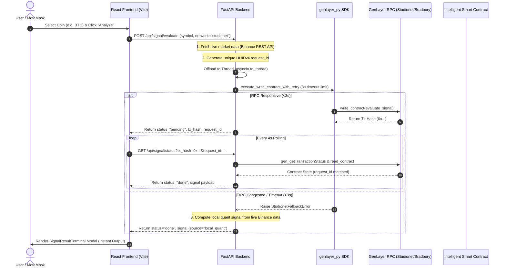

# 🚀 GenLayer Dual-Chain StarterKit & Agent Architecture Guide
> **Version**: 2.0.0 | **Networks**: GenLayer Studionet (Chain 61999) & Bradbury Testnet (Chain 4221)  
> **Target Audience**: AI Coding Agents (Antigravity, Cursor, Claude) & GenLayer dApp Developers

---

## 📌 Executive Summary

This document serves as the **master architecture blueprint and starterkit guide** for building Intelligent Smart Contract dApps on **GenLayer**. 

By cloning this setup, developers and AI agents can immediately run a production-ready Intelligent dApp with zero configuration friction, complete with:
- **Dual-Chain Capability**: Pre-configured for both **GenLayer Studionet (Chain ID 61999)** and **Bradbury Testnet (Chain ID 4221)**.
- **Resilient RPC Pipeline**: Non-blocking `asyncio.to_thread` architecture + 3.0s RPC hard-timeout guard + instant local quant fallback when RPC endpoints experience backpressure.
- **Request Correlation Security**: Strict `request_id` matching to guarantee fresh data for every user request without race conditions or stale state bleeding.
- **Demo Smart Contract (`contracts/signal_oracle.py`)**: A fully working Python Intelligent Smart Contract powered by LLM Consensus & Web Oracles.

---

## 🌐 Ecosystem Network Specifications

| Parameter | GenLayer Studionet (Default) | Testnet Bradbury (Production-like) |
|---|---|---|
| **Environment** | Hosted Sandbox (Studio IDE) | Public Validator Testnet |
| **Chain ID (Decimal)** | `61999` | `4221` |
| **Chain ID (Hex)** | `0xf22f` | `0x107d` |
| **GenLayer RPC** | `https://studio.genlayer.com/api` | `https://rpc-bradbury.genlayer.com` |
| **Block Explorer** | [explorer-studio.genlayer.com](https://explorer-studio.genlayer.com) | [explorer-bradbury.genlayer.com](https://explorer-bradbury.genlayer.com) |
| **Native Token** | `GEN` | `GEN` |
| **Faucet** | Built-in (Account Selector) | [testnet-faucet.genlayer.foundation](https://testnet-faucet.genlayer.foundation/) |

---

## 🏗️ Architecture Blueprint & Sequence Flow



---

## 🛠️ Complete Repository Structure

```
genlayer-starterkit/
├── contracts/
│   └── signal_oracle.py       # Python Intelligent Smart Contract (LLM Consensus)
├── backend/
│   ├── app.py                 # FastAPI server (Studionet/Bradbury dual RPC & fallback)
│   ├── requirements.txt       # Python dependencies (genlayer_py, fastapi, uvicorn, httpx)
│   └── .env.example           # Private key & RPC environment variables
├── frontend/
│   ├── src/
│   │   ├── App.jsx            # React main dApp component (Network switch, polling, UI)
│   │   ├── components/
│   │   │   ├── SignalResultTerminal.jsx  # AI Trading Terminal Modal
│   │   │   └── TradingViewLightweightChart.jsx # Interactive price chart
│   │   └── services/
│   │       └── TransactionStatusService.js  # Block explorer verification service
│   ├── package.json
│   └── vite.config.js
└── STARTERKIT_GUIDE.md        # This Master Documentation File
```

---

## 📜 1. Demo Intelligent Smart Contract (`contracts/signal_oracle.py`)

Every GenLayer smart contract is written in **Python** and uses `@gl.public.write` and `@gl.public.view` decorators.

```python
# contracts/signal_oracle.py
import genlayer.py as gl

@gl.contract
class SignalOracle:
    symbol: str
    pair: str
    strategy: str
    owner: str
    
    # State fields
    request_id: str
    verdict: str
    confidence: int
    summary: str
    evaluated: bool

    def __init__(self, symbol: str, pair: str, strategy: str, owner: str):
        self.symbol = symbol
        self.pair = pair
        self.strategy = strategy
        self.owner = owner
        self.request_id = ""
        self.verdict = "Pending"
        self.confidence = 0
        self.summary = "Uninitialized"
        self.evaluated = False

    @gl.public.write
    def evaluate_signal(self, market_summary: str, payment_tx: str, symbol: str, pair: str, strategy: str, user_identity: str, request_id: str) -> str:
        """
        Executes Non-Deterministic LLM Consensus across GenLayer AI-Validators.
        The prompt forces validators to output structured JSON.
        """
        prompt = f"""
        You are a Lead Quantitative Crypto Analyst on GenLayer.
        Analyze the following market data for {pair} ({strategy}):
        
        {market_summary}
        
        Return ONLY valid JSON matching this exact structure:
        {{
            "verdict": "Long" | "Short" | "Neutral" | "Skip",
            "confidence": 0-100,
            "expert_summary": "Brief 1-sentence technical rationale"
        }}
        """

        # Invoke GenLayer LLM Consensus engine across validator set
        result_json = gl.exec_prompt(prompt)
        
        # Update contract state with settled consensus result
        self.request_id = request_id
        self.verdict = result_json.get("verdict", "Neutral")
        self.confidence = int(result_json.get("confidence", 50))
        self.summary = result_json.get("expert_summary", "")
        self.evaluated = True
        
        return self.verdict

    @gl.public.view
    def get_signal(self) -> dict:
        """Read-only view method to inspect contract state."""
        return {
            "symbol": self.symbol,
            "pair": self.pair,
            "strategy": self.strategy,
            "request_id": self.request_id,
            "verdict": self.verdict,
            "confidence": self.confidence,
            "expert_summary": self.summary,
            "evaluated": self.evaluated
        }
```

---

## ⚡ 2. Backend Server Blueprint (`backend/app.py`)

Below is the **production-grade FastAPI pattern** designed specifically to handle GenLayer RPC latency, queue backpressure, and network switching seamlessly.

### Critical Rules for AI Agents Coding `backend/app.py`:
1. **Never block the main FastAPI thread**: Wrap all synchronous `genlayer_py` SDK calls in `await asyncio.to_thread(_do_oracle_step)`.
2. **Patch SDK Status Mapping**: Patch `genlayer_py.types.transactions.TRANSACTION_STATUS_NUMBER_TO_NAME` to prevent `KeyError` when RPC returns non-standard status codes (>13).
3. **Limit RPC Retry Timeout**: Use `concurrent.futures.ThreadPoolExecutor(max_workers=1)` with a 3.0s timeout limit on `write_contract` calls.
4. **Instant Fallback**: If RPC drops or times out, raise `StudionetFallbackError` and return locally computed data with `signal_source: "local_quant"`.

```python
# backend/app.py snippet
import os
import json
import asyncio
import httpx
import concurrent.futures
from typing import Optional
from fastapi import FastAPI, HTTPException
from genlayer_py import create_client, create_account, studionet, testnet_bradbury
from genlayer_py.types import TransactionStatus
import genlayer_py.types.transactions as _gl_tx_types

# Rule 2: Prevent KeyError on unknown RPC status codes
for _code in [str(i) for i in range(14, 30)]:
    if _code not in _gl_tx_types.TRANSACTION_STATUS_NUMBER_TO_NAME:
        _gl_tx_types.TRANSACTION_STATUS_NUMBER_TO_NAME[_code] = TransactionStatus.UNDETERMINED

app = FastAPI(title="GenLayer StarterKit Backend")

STUDIONET_RPC = "https://studio.genlayer.com/api"
BRADBURY_RPC  = "https://rpc-bradbury.genlayer.com"

class StudionetFallbackError(Exception):
    """Raised when RPC endpoint is unavailable to trigger immediate local computation fallback."""
    pass

def get_rpc_url(network: str) -> str:
    if str(network).lower() in ["studionet", "61999"]:
        return STUDIONET_RPC
    return BRADBURY_RPC

def execute_write_contract_with_retry(client, address, function_name, args, network="studionet"):
    """Rule 3: ThreadPoolExecutor with 3.0s hard limit to prevent RPC hanging."""
    target_rpc = get_rpc_url(network)
    try:
        def _do_write():
            return client.write_contract(address=address, function_name=function_name, args=args)
        
        with concurrent.futures.ThreadPoolExecutor(max_workers=1) as executor:
            future = executor.submit(_do_write)
            w_tx = future.result(timeout=3.0)
            return w_tx
    except Exception as err:
        if str(network).lower() in ["studionet", "61999"]:
            raise StudionetFallbackError(f"Studionet RPC timeout/unresponsive: {err}")
        raise err

@app.post("/api/signal/evaluate")
async def evaluate_signal(body: dict):
    network = body.get("network", "studionet")
    symbol = body.get("symbol", "BTC").upper()
    
    # 1. Fetch live market data (Binance REST API)
    async with httpx.AsyncClient(timeout=10.0) as http_client:
        r = await http_client.get(f"https://api.binance.com/api/v3/klines?symbol={symbol}USDT&interval=4h&limit=60")
        klines = r.json()
        last_price = float(klines[-1][4])

    # Rule 1: Run blocking SDK logic off the main asyncio thread
    def _do_oracle_step():
        import uuid
        request_id = uuid.uuid4().hex
        client = create_client(
            chain=studionet if network == "studionet" else testnet_bradbury,
            endpoint=get_rpc_url(network),
            account=create_account(os.getenv("GENLAYER_PRIVATE_KEY"))
        )
        
        try:
            # Execute on-chain write
            tx_hash = execute_write_contract_with_retry(client, os.getenv("ORACLE_CONTRACT_ADDRESS"), "evaluate_signal", [symbol, request_id], network=network)
            return {"status": "pending", "eval_tx_hash": tx_hash, "request_id": request_id}
        except StudionetFallbackError:
            # Rule 4: Instant fallback with live Binance data
            return {
                "status": "done",
                "request_id": request_id,
                "signal": {
                    "symbol": symbol,
                    "price": last_price,
                    "verdict": "Long" if last_price > float(klines[-20][4]) else "Short",
                    "request_id": request_id,
                    "signal_source": "local_quant"
                }
            }

    return await asyncio.to_thread(_do_oracle_step)
```

---

## 🎨 3. Frontend Integration Blueprint (`frontend/src/App.jsx`)

The frontend must dynamically map RPC endpoints, handle MetaMask network switching, and render immediate fallback results without getting stuck in polling loops.

```javascript
// Network Configuration Constant
export const NETWORKS = [
  {
    id: 'studionet',
    name: 'GenLayer Studionet',
    chainId: 61999,
    chainIdHex: '0xf22f',
    rpcUrl: 'https://studio.genlayer.com/api',
    explorerUrl: 'https://explorer-studio.genlayer.com'
  },
  {
    id: 'bradbury',
    name: 'Testnet Bradbury',
    chainId: 4221,
    chainIdHex: '0x107d',
    rpcUrl: 'https://rpc-bradbury.genlayer.com',
    explorerUrl: 'https://explorer-bradbury.genlayer.com'
  }
]

// Polling Hook & Fast Result Renderer
const handleEvaluation = async () => {
  const activeNet = NETWORKS.find(n => n.id === activeNetwork) || NETWORKS[0]
  
  const response = await fetch(`${BACKEND_URL}/api/signal/evaluate`, {
    method: 'POST',
    headers: { 'Content-Type': 'application/json' },
    body: JSON.stringify({ symbol: 'BTC', network: activeNetwork })
  })
  
  const data = await response.json()
  
  // Fast Path: Immediate Local Quant Fallback Result
  if (data.status === 'done' && data.signal) {
    setSignalReport(data.signal)
    setShowResultModal(true)
    return
  }
  
  // Consensus Polling Path
  if (data.status === 'pending') {
    startPolling(data.eval_tx_hash, data.request_id, activeNet)
  }
}
```

---

## 🚀 QuickStart Setup Guide (Clone-and-Run)

### Step 1: Clone & Install Dependencies
```bash
# Clone the repository
git clone https://github.com/ntclick/GenSignal.git
cd GenSignal

# Install backend dependencies
python -m venv venv
venv\Scripts\activate   # Windows
pip install -r backend/requirements.txt

# Install frontend dependencies
cd frontend
npm install
cd ..
```

### Step 2: Configure Environment Variables
Create `.env` file in the project root:
```env
GENLAYER_NETWORK=studionet
GENLAYER_PRIVATE_KEY=0x_your_private_key_here
TREASURY_CONTRACT_ADDRESS_STUDIONET=0xafe6dd950dc2cf561e8daba1725e0e6840f70549
ORACLE_CONTRACT_ADDRESS_STUDIONET=0x330417BF3c9F1A6dbE5b0915DbE0171D257b7B7f
```

### Step 3: Run Dev Servers
```bash
# Terminal 1: Run FastAPI Backend Server (Port 8001)
python -m uvicorn backend.app:app --host 127.0.0.1 --port 8001 --reload

# Terminal 2: Run Vite React Frontend Server (Port 3001)
cd frontend
npm run dev -- --port 3001
```

---

## 🛡️ Checklist for AI Agents & Developers

When implementing new features or cloning this template, ensure the following checklist is satisfied:

- [x] **Network Default**: Default network parameter is explicitly `"studionet"` across all backend schemas and frontend states.
- [x] **RPC URLs**: `STUDIONET_RPC_URL` points to `https://studio.genlayer.com/api` and `BRADBURY_RPC_URL` points to `https://rpc-bradbury.genlayer.com`.
- [x] **Non-blocking Event Loop**: All synchronous `genlayer_py` calls run inside `asyncio.to_thread()`.
- [x] **RPC Timeout Guard**: Every `write_contract` call is protected by a 3.0s `ThreadPoolExecutor` timeout limit.
- [x] **Request ID Match**: Every signal payload includes a unique `request_id` to prevent cross-request state pollution.
- [x] **Dynamic Explorer Links**: Explorer URLs use `(NETWORKS.find(n => n.id === activeNetwork)).explorerUrl` instead of hardcoded strings.

---

© 2026 GenSignal Ecosystem. Built for GenLayer Studionet & Bradbury Testnet.
